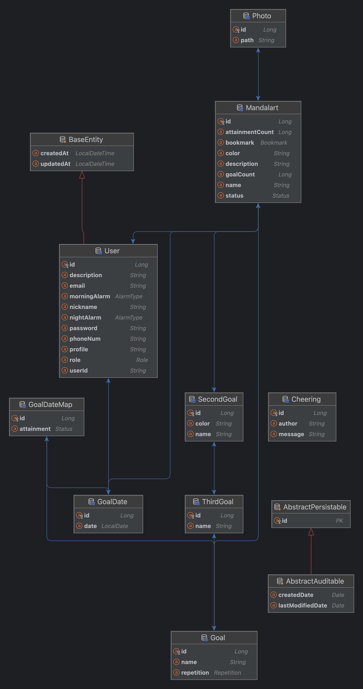

# 도닦기

 

## Tech Stack

### Server

 

### Database

### CI/CD

 

 

### Documents

## ERD

## Contributor

<table>
  <tbody>
      <td align="center"><a href="https://github.com/hyeonsoo0625"> <b>BE : 김현수 </b></a> </td>
      <td align="center"><a href="https://github.com/Junyewdd"> <b>BE : 전영은 </b></a> </td>
  </tbody>
</table>

<a href="#readme-top">back to top</a>

